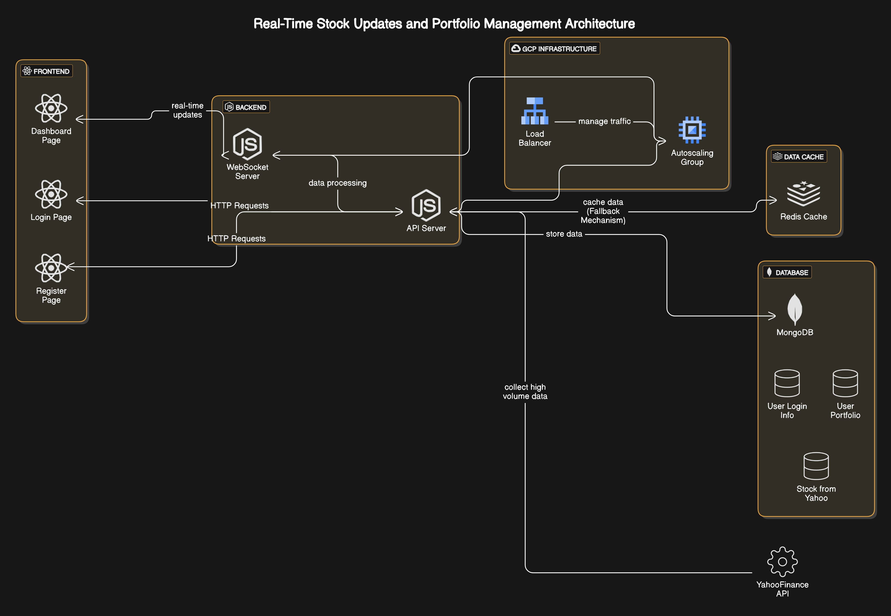

# Real-Time Portfolio Tracker with Data Streaming

## Table of Contents
- [Real-Time Portfolio Tracker with Data Streaming](#real-time-portfolio-tracker-with-data-streaming)
  - [Table of Contents](#table-of-contents)
    - [Overview](#overview)
    - [Architecture](#architecture)
    - [Tech Stack](#tech-stack)
    - [Features](#features)
    - [System Design](#system-design)
      - [Diagram](#diagram)

---

### Overview
The Real-Time Portfolio Tracker is a web application that allows users to monitor their stock portfolios with near real-time updates. The application fetches stock data using the yahoo-finance2 open source node library, implementing a 5-second delay to simulate a near-real-time experience. Users can upload their portfolio as a CSV file, which is stored in a database. 

### Architecture
This application is designed to handle high-volume, continuous data flow and provides seamless data streaming to the frontend using WebSockets. It will be deployed on Google Cloud Platform (GCP) to leverage scalability and resilience.

### Tech Stack
- **Frontend**: React (for user interface and real-time data updates)
- **Backend**: Node.js (for API handling, data processing, and WebSocket streaming)
- **Database**: MongoDB (for storing high-volume portfolio and stock data)
- **Cache**: Redis (for caching stock data to manage API availability)
- **Deployment**: Google Cloud Platform (Compute Engine for backend services, Load Balancer, Autoscaler)

### Features
- **Real-Time Stock Price Streaming**: Fetches stock data every 5 seconds from the Yahoo Finance API and streams it to users via WebSockets.
- **CSV Portfolio Upload**: Allows users to upload their portfolio details through a CSV file.
- **Data Fallback Mechanism**: Uses Redis to cache the last available data in case of API unavailability. An alternate solution is using my backend to connect to yahoo's websocket endpoint and possibly avoiding rate-limiting.
- **Scalable and Resilient Deployment**: Uses GCP Load Balancer and Autoscaler to ensure the application is available and scales as per demand.

### System Design
Below is the system design for the application, highlighting key components and data flow.

#### Diagram

```markdown



